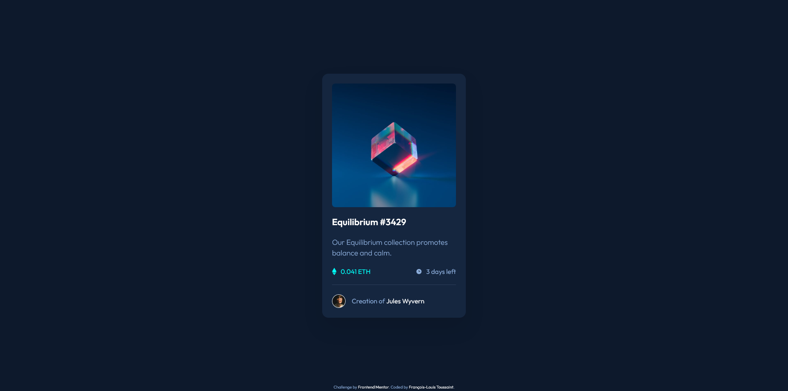

# Frontend Mentor - NFT preview card component solution

This is a solution to the [NFT preview card component challenge on Frontend Mentor](https://www.frontendmentor.io/challenges/nft-preview-card-component-SbdUL_w0U). Frontend Mentor challenges help you improve your coding skills by building realistic projects. 

## Table of contents

- [Overview](#overview)
  - [The challenge](#the-challenge)
  - [Screenshot](#screenshot)
  - [Links](#links)
- [My process](#my-process)
  - [Built with](#built-with)
  - [What I learned](#what-i-learned)
- [Author](#author)

## Overview

### The challenge

Users should be able to:

- View the optimal layout depending on their device's screen size
- See hover states for interactive elements

### Screenshot

### Links

- Solution URL: [Github](https://github.com/Francois-Louis/NFT-preview-card-challenge-FEM)
- Live Site URL: [Live site](https://francois-louis.github.io/NFT-preview-card-challenge-FEM/)

## My process

### Built with

- Semantic HTML5 markup
- CSS custom properties
- Flexbox
- Mobile-first workflow
- Sass

### What I learned

This was a real discovery and my early stages of Sass. And I liked it, and hope to learn how to use it better.

The biggest challenge for me was to recreate the overlay effect on the main picture.
After a lot of time, spent in searching solutions like filters, etc... I'm glad to have found a solution, maybe not the best, but it works.

## Author

- [Frontend Mentor](https://www.frontendmentor.io/profile/Francois-Louis)
- [Linkedin](https://www.linkedin.com/in/fran%C3%A7ois-louis-t-39a01b132/)
- [Twitter](https://twitter.com/KH4RNYX)

